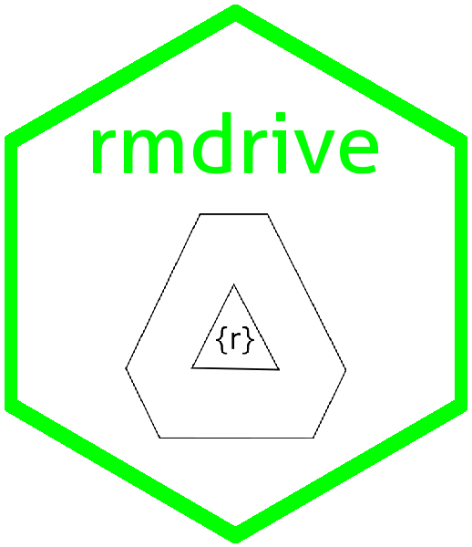

<!-- README.md is generated from README.Rmd. Please edit that file -->

# rmdrive 

rmdrive provides easy functions to move rmd files to googledrive for
synchronous collaboration, then return it back to a local .Rmd for
knitting.

# Installation

This package is not on CRAN. To use this package please un the following
code:

``` r
devtools::install_github("ekothe/rmdrive")
library(rmdrive)
```
