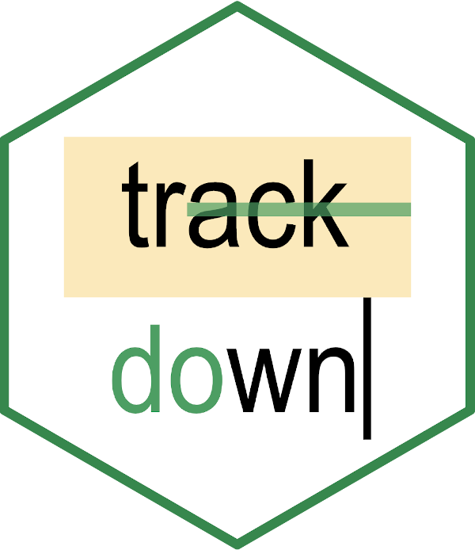

<!-- README.md is generated from README.Rmd. Please edit that file -->

# trackdown - R package for improving collaborative writing 

<!-- badges: start -->

[](https://www.repostatus.org/#active)
[](https://CRAN.R-project.org/package=trackdown)
[](https://github.com/claudiozandonella/trackdown/actions/workflows/check-standard.yaml)
[](https://app.codecov.io/gh/claudiozandonella/trackdown)
[](https://doi.org/10.5281/zenodo.5167320)
<!-- badges: end -->

## Overview

The `trackdown` package offers a simple solution for collaborative
writing and editing of R Markdown (or Sweave) documents. Using
`trackdown`, the local `.Rmd` (or `.Rnw`) file can be uploaded as a
plain-text file to Google Drive. By taking advantage of the easily
readable Markdown (or LaTeX) syntax and the well-known online interface
offered by Google Docs, collaborators can easily contribute to the
writing and editing process. After integrating all authors’
contributions, the final document can be downloaded and rendered
locally.

## Installation

You can install the released version from
[CRAN](https://CRAN.R-project.org/package=trackdown) with:

``` r
install.packages("trackdown")
```

To install the development version from
[GitHub](https://github.com/ClaudioZandonella/trackdown/), run the
following code:

``` r
# install.packages("remotes")
remotes::install_github("claudiozandonella/trackdown",
                         build_vignettes = TRUE)
library(trackdown)
```

## The `trackdown` Workflow

During the collaborative writing/editing of an `.Rmd` (or `.Rnw`)
document, it is important to employ different workflows for computer
code and narrative text:

-   **Code** - Collaborative code writing is done most efficiently by
    following a traditional **Git**-based workflow using an online
    repository (e.g., GitHub or GitLab).
-   **Narrative Text** - Collaborative writing of narrative text is done
    most efficiently using **Google Docs** which provides a familiar and
    simple online interface that allows multiple users to simultaneously
    write/edit the same document.

Thus, the workflow’s main idea is simple: Upload the `.Rmd` (or `.Rnw`)
document to Google Drive to collaboratively write/edit the narrative
text in Google Docs; download the document locally to continue working
on the code while harnessing the power of Git for version control and
collaboration. This iterative process of uploading to and downloading
from Google Drive continues until the desired results are obtained. The
workflow can be summarized as:

> Collaborative **code** writing using **Git** & collaborative writing
> of **narrative text** using **Google Docs**

<!-- pakgdown code-->
<!-- <iframe width="800" height="450" src="https://www.powtoon.com/embed/bWtc2qqbZ5F/" align="middle" frameborder="0" allowfullscreen></iframe> -->
<!-- Github code -->
<center>
<a href="https://www.powtoon.com/embed/bWtc2qqbZ5F/" target="_blank">

</a>
</center>

### Functions

`trackdown` offers different functions to manage the workflow:

-   `upload_file()` uploads a file for the first time to Google Drive.
-   `update_file()` updates the content of an existing file in Google
    Drive with the contents of a local file.
-   `download_file()` downloads the edited version of a file from Google
    Drive and updates the local version.
-   `render_file()` downloads a file from Google Drive and renders it
    locally.

### Special Features

`trackdown` offers additional features to facilitate the collaborative
writing and editing of documents in Google Docs. In particular, it is
possible to:

-   **Hide Code:** Code in the header of the document (YAML header or
    LaTeX preamble) and code chunks are removed from the document when
    uploading to Google Drive and are automatically restored during
    download. This prevents collaborators from inadvertently making
    changes to the code which might corrupt the file and allows them to
    focus on the narrative text.
-   **Upload Output:** The actual output document (i.e., the rendered
    file) can be uploaded to Google Drive in conjunction with the `.Rmd`
    (or `.Rnw`) document. This helps collaborators to evaluate the
    overall layout including figures and tables and allows them to add
    comments to suggest and discuss changes.
-   **Use Google Drive shared drives:** The documents can be uploaded to
    either a personal Google Drive or to a shared drive to facilitate
    collaboration.

### Advantages of Google Docs

Google Docs offers users a familiar, intuitive, and free web-based
interface that allows multiple users to simultaneously write/edit the
same document. In Google Docs it is possible to:

-   track changes (incl. accepting/rejecting suggestions)
-   add comments to suggest and discuss changes
-   check spelling and grammar errors (potentially integrating
    third-party services like Grammarly)

Moreover, Google Docs allows anyone to contribute to the writing/editing
of the document. No programming experience is required, users can just
focus on writing/editing the narrative text.

Note that not all collaborators have to have a Google account (although
this is recommended to utilize all Google Docs features). Only the
person who manages the `trackdown` workflow needs to have a Google
account to upload files to Google Drive. Other collaborators can be
invited to contribute to the document using a shared link (See
[Instructions](https://support.google.com/drive/answer/2494822?co=GENIE.Platform%3DDesktop&hl=en&oco=0)).

### Documentation and Vignettes

All documentation is available at
<https://claudiozandonella.github.io/trackdown/>.

To know more about `trackdown`, please reference:

-   `vignette("trackdown-features")` for a detailed description of the
    function arguments and features.
-   `vignette("trackdown-workflow")` for a workflow example and
    discussion of how to collaborate on narrative text and code.
-   `vignette("trackdown-tech-notes")` for details regarding technical
    details like authentication and file management.

## Contributing to `trackdown`

Development of the `trackdown` package is an ongoing project, surely
there are many issues to fix and features to propose/add. Anyone is
welcome to contribute to the development.

Please note that this project is released under a [Contributor Code of
Conduct](https://www.contributor-covenant.org/). By contributing to this
project, you agree to abide by its terms.

See [Community
guidelines](https://github.com/claudiozandonella/trackdown/blob/develop/CONTRIBUTING.md)
for further information.

## Citation

To cite `trackdown` in publications use:

Emily Kothe, Claudio Zandonella Callegher, Filippo Gambarota, Janosch
Linkersdörfer and Mathew Ling (2021). trackdown: Collaborative Writing
and Editing of R Markdown (or Sweave) Documents in Google Drive.
<https://doi.org/10.5281/zenodo.5167320>.

The BibTeX entry is:

    @Manual{,
      title = {trackdown: Collaborative Writing and Editing of R Markdown (or Sweave) Documents in Google Drive},
      author = {Emily Kothe and Claudio Zandonella Callegher and Filippo Gambarota and Janosch Linkersdörfer and Mathew Ling},
      year = {2021},
      note = {R package version 1.1.1},
      url = {https://github.com/claudiozandonella/trackdown},
      doi = {10.5281/zenodo.5167320},
    }
