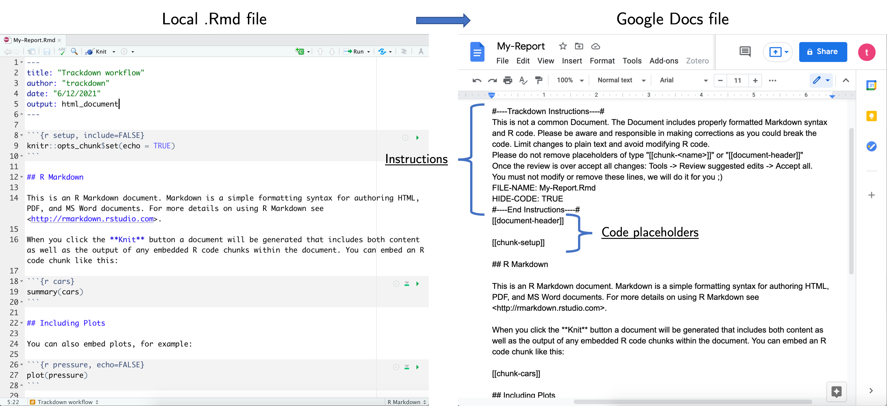

```{r setup, include=FALSE}
knitr::opts_chunk$set(echo = TRUE, eval = FALSE)
```

# Summary

Literate programming allows combining narrative text and code to produce elegant, high quality and reproducible documents. These are fundamental ingredients of modern open science fostering transparency and reproducibility of the scientific results. 

The main downside of literate programming, however, is the lack of appropriate tools for collaborative writing and editing of the document. In fact, producing a document with a literate programming approach requires programming skills which complicates the collaborative workflows considering different backgrounds among collaborators. Furthemore, common version control systems (e.g., Git) are extremely powerful to collaborate on the code but less efficient and interactive for the narrative part of a document. On the contrary, common word processors (e.g., Microsoft Word or Google Docs) offer a smoother experience in terms of real time editing and reviewing. 

`trackdown` overcomes these issues combining the strengths of literate programming in R with the collaborative features offered by popular word processor Google Docs.

# Statement of need 

`trackdown` is an R package offering a simple solution for collaborative writing and editing of R Markdown (or Sweave) documents. When collaborating on the writing of a `.Rmd` (or `.Rnw`) document it is important to consider separately code and narrative text:

- **Code** - Collaborative code writing is done efficiently following traditional Git workflow based on an online repository (e.g., GitHub or GitLab)
- **Narrative Text** - Collaborative writing of the narrative text is done efficiently on Google Docs where the familiar and simple online interface allows multiple users to simultaneously write and edit the same document

`trackdown` uploads the local `.Rmd` (or `.Rnw`) file as plain-text in Google Drive where, thanks to the easily readable Markdown (or LaTeX) syntax and the well-known online interface offered by Google Docs, collaborators can easily contribute to the writing and editing of the narrative text. After integrating all authors’ contributions, the document can be downloaded to continue collaborating on the code using Git. This iterative process of uploading to and downloading from Google Drive continues until the desired results are obtained. The workflow can be summarized as:

> Collaborative code writing using Git and collaborative writing of narrative text on Google Docs 

Also other R packages aiming to improve tracking changes and reviewing experience of R Markdown (or Sweave) documents are available: `redoc` [@redoc] offers a two-way R Markdown-Microsoft Word workflow; `reviewer` [@reviewer] allows to evaluate differences between two rmarkdown files and annotatate HTML using the Hypothes.is service; `trackmd` [@trackmd] is an RStudio addin for tracking changes in Markdown format; `latexdiffr` [@latexdiffr] create a diff of two Rmarkdown, .Rnw or TeX files. These packages, however, are based on less efficient workflow and all of them, but `latexdiffr`, are no longer active projects. In particular, `trackdown` has the advantage of being based on Google Docs that offers a familiar, intuitive, and free online interface allowing multiple users to simultaneously write, edit, comment the same document. Moreover, `trackdown` does not even require collaborators to install R as all changes to the narrative text can be done directly on Google Docs, a great advantage for colleagues with no programming experience.

The package is available from GitHub (https://github.com/ekothe/trackdown) 
<!-- and CRAN (https://CRAN.R-project.org/package=trackdown) -->
. Documentation about the package is available at https://ekothe.github.io/trackdown/.

# Workflow Example

Suppose you want to collaborate with your colleagues on the writing of an R Markdown document. If you are the most experienced among your colleagues with R and in programming in general, it would be better if you manage and organize the workflow. 

## Upload File

You create the initial document, for example `My-Report.Rmd`, and upload the file in Google Drive using the function `upload_file()`:

```{r, echo = TRUE, eval = FALSE}
library(trackdown)
update_file(file = "path-to-file/My-Report.Rmd", 
            hide_code = TRUE)
```

In this way, the `My-Report.Rmd` file is uploaded from your local computer to your Google Drive. Note that `trackdown` adds some simple instructions and reminders on the top of the document and, by specifying the argument `hide_code = TRUE`, the header code (YAML) and code chunks are removed from the document displaying instead placeholders of type "[[document-header]]" and "[[chunk-\<name\>]]" (See \autoref{fig:example-upload}). This allows collaborators to focus only on the narrative text ignoring code jargon. 


## Collaborate

After uploading your document on Google Drive, you can now share the link to the document with your colleagues and invite them to collaborate on the writing of the narrative text. Google Docs offers a familiar, intuitive, and free online interface that allows multiple users to simultaneously write and edit the same document. In particular, in Google Docs you can: easily track changes; add comments to propose and discuss suggestions; check spelling and grammar errors (See \autoref{fig:example-edit}).

{ width=60% }

## Download File {#ex-download}

At some point, you may want to add some more code to include figures, tables or results from the analyses. This can not be done directly in Google Docs, so you are required to download the document. First accept all changes made to the document in Google Docs, than download the edited version of the document from Google Drive using the function `download_file()`:

```{r, echo = TRUE, eval = FALSE}
download_file(file = "path-to-file/My-Report.Rmd")
```

Note that downloading the file from Google Drive will overwrite the local file.  

## Update File {#ex-update}

Once you added the required code chunks, further editing on the narrative text may still be necessary. In this case, you first update the file in Google Drive with your local version of the document using the function `update_file()`:

```{r, echo = TRUE, eval = FALSE}
update_file(file = "path-to-file/My-Report.Rmd", hide_code = TRUE)
```

In this way, the document in Google Drive is updated with your latest changes. Now you and your colleagues can continue collaborating on the narrative text. Note that updating the file in Google Drive will overwrite its current content.

This iterative process of uploading to and downloading from Google Drive continues until the desired results are obtained.

# References


