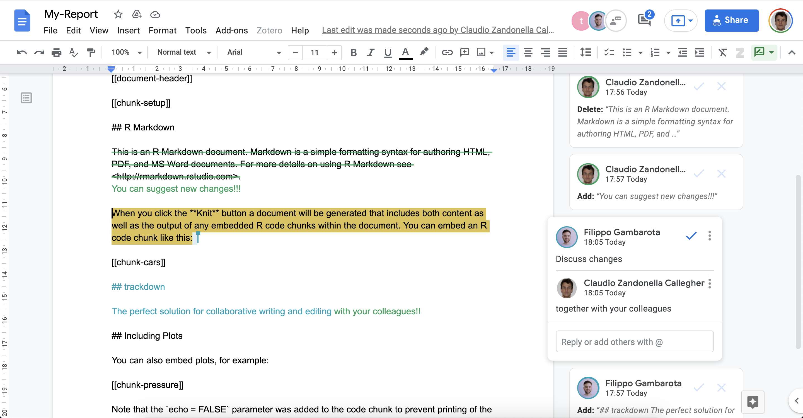

# Summary

Literate programming allows to combine narrative text and computer code to produce elegant, high quality, and reproducible documents. These are fundamental requirements of modern open science workflows fostering transparency and reproducibility of scientific results. 

A major downside of literate programming, however, is the lack of tools for collaborative writing and editing. Producing a document following a literate programming approach requires programming skills which can complicate the collaboration with colleagues who lack those skills. Furthermore, while commonly used version control systems (e.g., Git) are extremely powerful for collaborating on the writing of computer code, they are less efficient and lack the interactivity needed for collaborating on the writing of the narrative part of a document. On the contrary, common word processors (e.g., Microsoft Word or Google Docs) offer a smoother experience in terms of real-time editing and reviewing. 

`trackdown` overcomes these issues by combining the strengths of literate programming in R with the collaborative features offered by the popular word processor Google Docs.

# Statement of need 

`trackdown` is an R package offering a simple solution for collaborative writing and editing of R Markdown (or Sweave) documents. During the collaborative writing/editing of an `.Rmd` (or `.Rnw`) document, it is important to employ different workflows for computer code and narrative text:

- **Code** - Collaborative code writing is done most efficiently by following a traditional **Git**-based workflow using an online repository (e.g., GitHub or GitLab).
- **Narrative Text** - Collaborative writing of narrative text is done most efficiently using **Google Docs** which provides a familiar and simple online interface that allows multiple users to simultaneously write/edit the same document.

Thus, the workflow’s main idea is simple: Upload the `.Rmd` (or `.Rnw`) document to Google Drive to collaboratively write/edit the narrative text in Google Docs; download the document locally to continue working on the code while harnessing the power of Git for version control and collaboration. This iterative process of uploading to and downloading from Google Drive continues until the desired results are obtained (See \autoref{fig:trakdown-workflow}). The workflow can be summarized as:

> Collaborative **code** writing using **Git** & collaborative writing of **narrative text** using **Google Docs**  


Other R packages aiming to improve the user experience during the collaborative editing of R Markdown (or Sweave) documents are available: `redoc` [@redoc] offers a two-way R Markdown-Microsoft Word workflow; `reviewer` [@reviewer] allows to evaluate differences between two rmarkdown files and add notes using the Hypothes.is service; `trackmd` [@trackmd] is an RStudio add-in for tracking changes in Markdown format; `latexdiffr` [@latexdiffr] creates a diff of two R Markdown, .Rnw or LaTeX files. However, these packages implement a less efficient writing/editing workflow and all of them, but `latexdiffr`, are no longer under active development. In particular, the `trackdown` workflow has the advantage of being based on Google Docs which offers users a familiar, intuitive, and free web-based interface that allows multiple users to simultaneously write/edit the same document. Moreover, `trackdown` allows anyone to contribute to the writing/editing of the document. No programming experience is required, users can just focus on writing/editing the narrative text in Google Docs.

The package is available on GitHub (https://github.com/claudiozandonella/trackdown) 
<!-- and CRAN (https://CRAN.R-project.org/package=trackdown) -->
. All the documentation is available at https://claudiozandonella.github.io/trackdown/.

# Workflow Example

Suppose you want to collaborate with your colleagues on the writing of an R Markdown document, e.g., to prepare a submission to a scientific journal. If you are the most experienced among your colleagues in the usage of R and programming in general, you should take responsibility for managing and organizing the workflow.

## Upload File

You create the initial document, for example `My-Report.Rmd`, and upload the file to Google Drive using the function `upload_file()`:


```r
library(trackdown)
update_file(file = "path-to-file/My-Report.Rmd", 
            hide_code = TRUE)
```

By executing this command, the `My-Report.Rmd` file is uploaded from your local computer to your Google Drive. Note that `trackdown` adds some simple instructions and reminders on top of the document and, by specifying the argument `hide_code = TRUE` (default is `FALSE`), the header code (YAML) and code chunks are removed from the document displaying instead placeholders of type "[[document-header]]" and "[[chunk-\<name\>]]" (See \autoref{fig:example-upload}). This allows collaborators to focus on the narrative text. 


## Collaborate

After uploading your document to Google Drive, you can now share a link to the document with your colleagues and invite them to collaborate on the writing of the narrative text. Google Docs offers a familiar, intuitive, and free web-based interface that allows multiple users to simultaneously write/edit the same document. In Google Docs it is possible to: track changes (incl. accepting/rejecting suggestions); add comments to suggest and discuss changes; check spelling and grammar errors (See \autoref{fig:example-edit}).

{ width=100% }

## Download File {#ex-download}

At some point, you will want to add some code to the document to include figures, tables, and/or analysis results. This should not be done in Google Docs, instead, you should first download the document. Accept/reject all changes made to the document in Google Docs, then download the edited version of the document from Google Drive using the function `download_file()`:


```r
download_file(file = "path-to-file/My-Report.Rmd")
```

Note that downloading the file from Google Drive will overwrite the local file. 

## Update File {#ex-update}

Once you added the required code chunks, further editing of the narrative text may be necessary. In this case, you first update the file in Google Drive with your local version of the document using the function `update_file()`:


```r
update_file(file = "path-to-file/My-Report.Rmd", 
            hide_code = TRUE)
```

By executing this command, the document in Google Drive is updated with your latest local changes. Now you and your colleagues can continue to collaborate on the writing of the document. Note that updating the file in Google Drive will overwrite its current content.

This iterative process of updating the file in Google Drive and downloading it locally continues until the desired results are obtained.

# References
