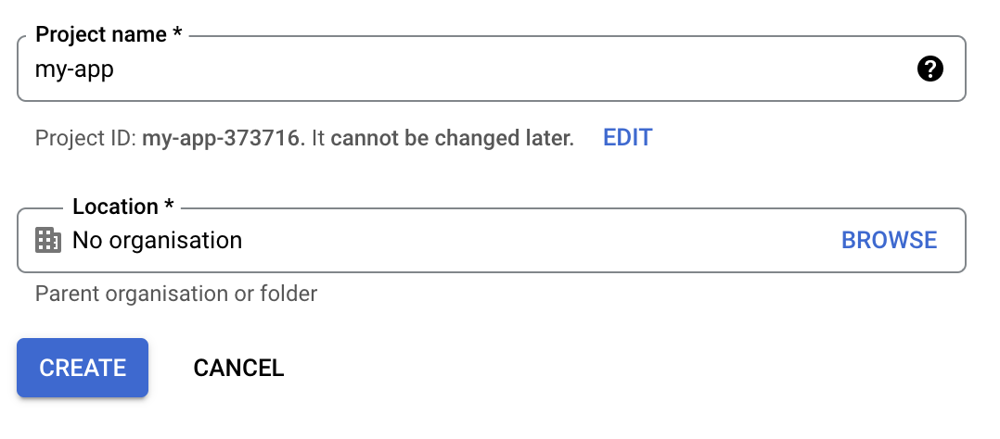
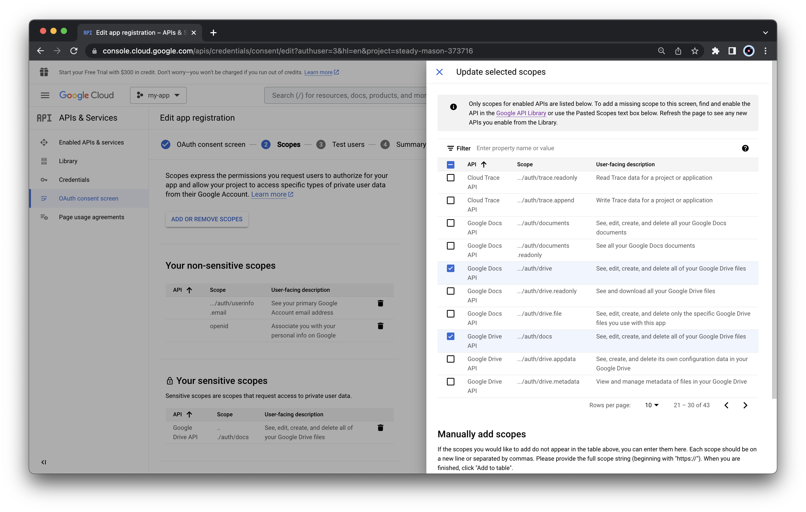
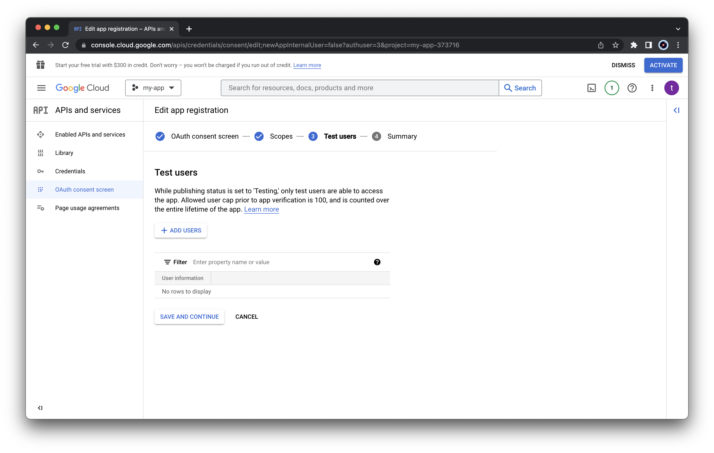

```{r, include = FALSE}
knitr::opts_chunk$set(
  collapse = TRUE,
  echo = FALSE,
  eval = TRUE,
  fig.align = "center",
  comment = "#>"
)
```

To upload, edit, and download our files in Google Drive, trackdown relies on the Google APIs. 
Using Google APIs requires two main things:

- Creating an app in Google Cloud Console and activate the required Google APIs
- Managing users' authentication and authorization in R

In the next sections, we describe all the steps to configure everything is needed to use trackdown.

## Creating an App in Google Cloud Console

> Trackdown already provides an internal app to use the Google APIs. However, the numebr of users is limited and we already reached the maximum number (i.e., 100 users). Thus to use trackdown, we are required to create our own App in Google Cloud Console.

To create an App in Google Cloud Console, follow these steps:

1. Access Google Cloud Console at https://console.cloud.google.com/. If this is our first time, we will need to select our country and accept the *terms of service*
1. Create a new project by clicking the button *"Select a project"* and then the button  *"NEW PROJECT"*
```{r, out.width="90%", fig.alt = 'Google Cloud Console create a new project menu'}
knitr::include_graphics('images/01-new-proj.png')
```
  Specify the name of the project and click *"CREATE"*
```{r, out.width="50%", fig.alt = 'Google Cloud Console create a new project settings'}

```
  Select the newly created project to open it
```{r, out.width="90%", fig.alt = 'Google Cloud Console slect a project menu'}
knitr::include_graphics('images/03-proj-select.png')
```
1. Now we need to activate the required APIs. From the left menu select *"APIs and services" > "Enable APIs and services"*
```{r, out.width="90%", fig.alt = 'Google Cloud Console Enable APIs ans services menu'}
knitr::include_graphics('images/04-api.png')
```
  Click the *"ENABLE APIS AND SERVICES"* button
```{r, out.width="90%", fig.alt = 'Google Cloud Console Enable APIs ans services button'}

```
  Using the API Library search service we need to select two APIs
```{r, out.width="50%", fig.alt = 'Google Cloud Console search for APIs and services'}
knitr::include_graphics('images/06-api-search.png')
```
  Select *"Google Drive API"* from the list and click *"ENABLE"*
```{r, out.width="90%", fig.alt = 'Google Cloud Console enable Google Drive API'}
knitr::include_graphics('images/07-api-drive.png')
```
  Select *"Google Docs API"* from the list and click *"ENABLE"*
```{r, out.width="90%", fig.alt = 'Google Cloud Console enable Google Docs API'}
knitr::include_graphics('images/08-api-docs.png')
```
1. Next, we need to specify the setting of the consent screen. From the left menu, select *"OAuth consent screen"*, choose *"External"* as User Type and click *"CREATE"*
```{r, out.width="90%", fig.alt = 'Google Cloud Console OAuth consent screen creation'}
knitr::include_graphics('images/09-consent-external.png')
```
  Specify the App information *"App name"* and *"User support email"* (use your email)
```{r, out.width="90%", fig.alt = 'Google Cloud Console app registration infrmation (part I)'}
knitr::include_graphics('images/10-consent-info.png')
```
  Specify also the developer contact information (use your email) and press *"SAVE AND CONTINUE"*
```{r, out.width="90%", fig.alt = 'Google Cloud Console app registration infrmation (part II)'}
knitr::include_graphics('images/11-consent-contact.png')
```
1. Next, we need to select the required scopes. Click *"ADD OR REMOVE SCOPES"*
```{r, out.width="90%", fig.alt = 'Google Cloud Console app registration add scopes'}
knitr::include_graphics('images/12-scopes.png')
```
  Select the required scopes *".../auth/userinfo.email"* and *"openid"*
```{r, out.width="90%", fig.alt = 'Google Cloud Console app registration select required scopes (part I)'}

```
  Select also *".../auth/drive"* and *".../auth/docs"*
```{r, out.width="90%", fig.alt = 'Google Cloud Console app registration select required scopes (part II)'}

```
  Click *"Update"* at the end of the list to save changes. As we selected sensitive scopes, a pop-out will appear. Do not worry, these scopes are required to managed files in Google Drive. Click *"CONTINUE"*
  
    > After selecting all the required scopes, we should obtain the following summary list
    >   ```{r, out.width="60%", fig.alt = 'Google Cloud Console app registration summary list scopes'}
    >   knitr::include_graphics('images/15-scope-summary.png')
    >   ```
    > To be precise, only one among *".../auth/drive"* and *".../auth/docs"* is necesssary. However, to avoid any possible issue we selected both
  
1. **[OPTIONAL]** In the next section, it is possible to specify users (by email) to allow them using our newly created app. Alternatively, we can publish the app to let everyone (with whom we share the app credentials) to use the app (see below)
```{r, out.width="90%", fig.alt = 'Google Cloud Console app registration add test users'}

```
1. In the *"Summary"* section, we can check all the details and press *"BACK TO DASHBOARD"* for saving all changes
1. Next, we can publish our app to allow anyone (with whom we share the app credentials) to use our app (in this way we do not need to add email manually to the testers list). To do that, click *"PUBLISH APP"* from the *"OAuth consent screen"* and confirm
```{r, out.width="90%", fig.alt = 'Google Cloud Console publish app'}

```
1. Now, we need to obtain the credentials to use our newly created app. From the *"Credentials"* panel, click *"CREATE CREDENTIALS"* and select *"OAuth client ID"*
```{r, out.width="90%", fig.alt = 'Google Cloud Console OAuth client ID credentials creation menu'}
knitr::include_graphics('images/17-credentials.png')
```
  As *"Application type"*, select *"Desktop app"* and specify the client app name. Next click *"CREATE"*
```{r, out.width="50%", fig.alt = 'Google Cloud Console OAuth client ID credentials creation settings'}
knitr::include_graphics('images/18-credentials-type.png')
``` 
  A window will display the credentials to use the app. We need to download the JSON file with the credentials by clicking *"DOWNLOAD JSON"* or alternatively we can copy the *"Client ID"* and *"Client Secret"*
```{r, out.width="50%", fig.alt = 'Google Cloud Console OAuth client ID created credentials'}
knitr::include_graphics('images/19-credentials-popout.png')
```
  This information are required to use the Google APIs through our newly created app. Only users with this information can use our app. We can also retrieve the credentials in a second moment by clicking the download button from the list *"OAuth2.0 Client IDs"*
```{r, out.width="70%", fig.alt = 'Google Cloud Console OAuth client ID credentials list'}
knitr::include_graphics('images/20-credentials-client.png')
```


## Users' authentication in R

Once created our app and obtained the credentials to use it (i.e., the JSON file), we are ready to configure trackdown.

To configure trackdown, follow these steps:

1. Save the JSON file with the app credentials in a safe place. This file should be shared only with required users. Avoid saving this file in public repositories (more details below)
1. We need to pass the app credentials to trackdown in order to use the Google APIs. To do that, we  need to do one of the following things:
    - Set the `TRACKDOWN_APP` environment variable to the location of the JSON file. It is convenient to do this in our `.Renviron` file with `usethis::edit_r_environ()`. In this way, trackdown will be able to automatically retrieve the app credentials. Be careful of using the correct absolute/relative path according to the specific needs
    - Call `trackdown_auth_configure(path = "path/to/downloaded/json")` by indicating where the JSON lives. This command needs to be run at each session 
    - Alternatively, instead of using the JSON details, we can specify directly the app client id and secret. Client id and secret can be copied from the *"Credentials"* panel from the Google Cloud Console (see above). 
      ```{r, eval=FALSE, echo=TRUE}
      my_app <- httr::oauth_app(
        appname = "acme-corp",
        key     = "123456789.apps.googleusercontent.com",
        secret  = "abcdefghijklmnopqrstuvwxyz"
      )
      trackdown_auth_configure(app = my_app)
      ```
1. Next, the first time we use trackdown, we will be directed to a web browser and asked to sign in to our Google account to grant permission to communicate with Google Drive.
1. We will get a scary warning about an untrusted application, this is because the application is the one we just created. Click *"Advanced"* and *"Go to My App (unsafe)"* to proceed to do the oauth flow.
```{r, out.width="90%", fig.alt = 'Google account access warning app not verified'}

```
1. Select all options (all are **required**) and continue.
```{r, out.width="90%", fig.alt = 'Google account access settings'}
knitr::include_graphics('images/22-acccess.png')
```

Now, we are ready to use trackdown!

## Details

### App Credentials

It is important that trackdown has access to the app credentials. 

By default, trackdown first checks if the path to the JSON file is specified via the `TRACKDOWN_APP` environment variable. If not, trackdown will use its internal credentials. However, we have already exceeded the user limits. So, user custom app credentials need to be indicated specifying the JSON file path or the app info (obtained via `httr::oauth_app()` function) in the function `trackdown_auth_configure()`.
    
If you see the following error is because you are using the trackdown internal credentials and we have already exceeded the user limits.
```{r, out.width="90%", fig.alt = 'Google account access warning app blocked'}
knitr::include_graphics('images/23-errror.png')
```

> Note that the credential used by trackdown will be automaticlayy applied alsso to googledrive package functions used internally by trackdown functions


### User's Credentials

trackdown manage the authentication process using gargle R-package.  By default, user credentials are cached in a folder in the user’s home directory, `~/.R/gargle/gargle-oauth`, from where they can be automatically refreshed, as necessary. Storage at the user level means that the same token can be used across multiple projects and tokens are less likely to be synced to the cloud by accident. Note that if one is using R from a web-based platform like RStudio Server or Cloud, there will be a variant of this user authentication flow, known as out-of-band auth (“oob”). 

It is possible to personalize gargle’s default settings by adding options in the `.Rprofile` startup file. For example, the preferred Google account and cache folder can be set:

```{r, eval=FALSE, echo=TRUE}
options(
  gargle_oauth_email = "my_email@gmail.com",
  gargle_oauth_cache = "/path/to/folder/that/does/not/sync/to/cloud"
)
```


### Resources

For more details see:

- https://gargle.r-lib.org/articles/gargle-auth-in-client-package.html#changing-identities-and-more 
- https://gargle.r-lib.org/articles/get-api-credentials.html#oauth-client-id-and-secret
- https://gargle.r-lib.org/index.html

To learn how to manage credential securely, see:
- https://gargle.r-lib.org/articles/managing-tokens-securely.html


