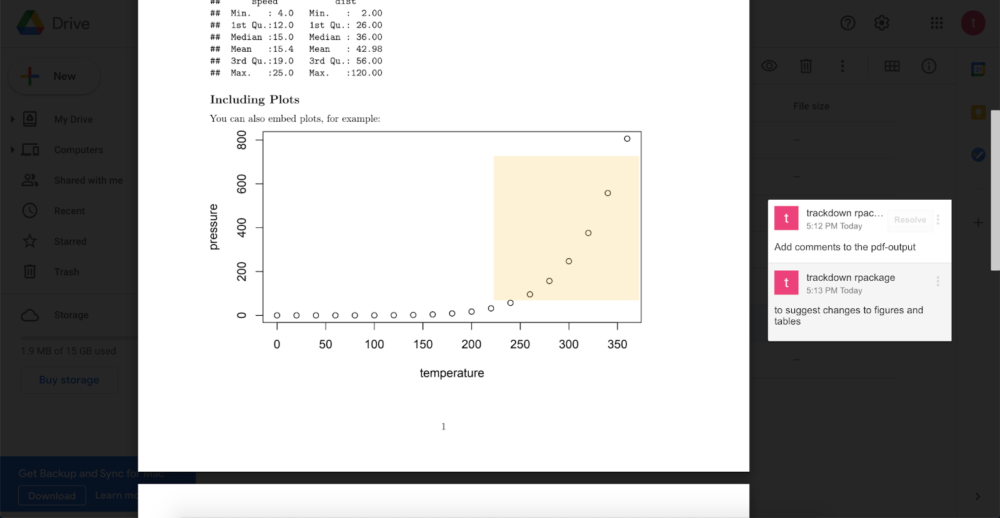

```{r, include = FALSE}
knitr::opts_chunk$set(
  collapse = TRUE,
  echo = TRUE,
  eval = FALSE,
  comment = "#>"
)
```

The main idea behind the `trackdown` workflow is simple: Upload the `.Rmd` (or `.Rnw`) document to Google Drive to collaboratively write/edit the narrative text in Google Docs; download the document locally to continue working on the code while harnessing the power of Git for version control and collaboration. 

To manage this workflow, `trackdown` offers different functions:

- `upload_file()` uploads a file for the first time to Google Drive.
- `update_file()` updates the content of an existing file in Google Drive with the contents of a local file.
- `download_file()` - downloads the edited version of a file from Google Drive and updates the local version.
- `render_file()` - downloads a file from Google Drive and renders it locally.

Moreover, `trackdown` offers additional features to facilitate the collaborative writing and editing of documents in Google Docs. In particular, it is possible to:

- **Hide Code** (See [hide_code](#hide-code)): Code in the header of a document (YAML header or LaTeX preamble) and code chunks are removed from the document when uploading to Google Drive and are automatically restored during download. This prevents collaborators from inadvertently making changes to the code which might corrupt the file and allows them to focus on the narrative text.
- **Upload Output** (See [path_output](#path-output)): The actual output document (i.e., the rendered file) can be uploaded to Google Drive in conjunction with the `.Rmd` (or `.Rnw`) document. This helps collaborators to evaluate the overall layout including figures and tables and it allows them to add comments to suggest and discuss changes.
- **Use Google Drive shared drives** (See [shared_drive](#shared-drive)): The documents can be uploaded to either a personal Google Drive or to a shared drive to facilitate collaboration.


For a general overview of the package, see the `trackdown-package` help page or `vignette("trackdown-workflow")` to know more about the workflow and `vignette("trackdown-tech-notes")` for an overview of technical details. 

## Arguments and Features {#arg-feat}

All `trackdown` functions share some common arguments that are used to manage the workflow:

```
*_file(file,
       gfile = NULL,
       gpath = "trackdown",
       shared_drive = NULL)
```

Moreover, when uploading or updating a file in Google Drive with `upload_file()` or `update_file()` respectively, two extra arguments are available:

- `hide_code` to hide the header code and code chunks from the document.
- `path_output` to upload the rendered output document to Google Drive in conjunction with the .Rmd (or .Rnw) document.

In this section, all arguments of `trackdown` functions are introduced, describing default settings and highlighting main features.

#### `file` {#file}

A string indicating the path of the local `.Rmd` (or `.Rnw`) file. 

All `trackdown` functions take as reference the local file to manage the workflow. Thus, the `file` argument is mandatory, both when uploading (or updating) a file to Google Drive or when downloading the edited version from Google Drive.  

#### `gfile` {#gfile}

A string indicating the name of the file in Google Drive.

By default (`NULL`), the name of the local file (without extension) is used as the name of the file in Google Drive. By specifying the `gfile` argument one can personalize the name of the file in Google Drive. In this case, one has to remember to point to the correct file in Google Drive every time one updates or downloads the file during the collaborative writing process.

#### `gpath` {#gpath}

A string indicating a directory in My Drive or in a shared drive (optional).

By default, files are uploaded to the folder `"trackdown/"` on Google Drive. To specify another folder, the full path is required (e.g., `"trackdown/my_folder/"`). If the indicated folder is not already available on Google Drive, the user is asked for permission to create it. One can use `NULL` to upload the file directly at the root level, although this is not recommended.

#### `shared_drive` {#shared-drive}

A string indicating the name of a shared drive (optional). 

By default, a personal Google Drive (i.e., My Drive) is used, but a shared drive can be specified to facilitate collaboration.

#### `hide_code` {#hide-code}

A logical value indicating whether code in the header of the document (YAML header or LaTeX preamble) and code chunks should be removed from the document when it is uploaded (or updated).

This argument is available only for the `upload_file()` and `update_file()` functions. By default, the value is set to `FALSE`. If set to `TRUE`, the code in the document header and code chunks will be removed from the document and automatically restored when downloaded. Placeholders of type "[[document-header]]" and "[[chunk-\<name\>]]" are displayed instead. 

This feature is intended to prevent collaborators from inadvertently making changes to the code in Google Docs that might corrupt the file and allows them to focus on the narrative text. Note that to guarantee correct code restoration, placeholders must not be modified or removed.

#### `path_output` {#path-output}

A string indicating the output path (i.e., the resulting rendered document).

This argument is available only for the `upload_file()` and `update_file()` functions. By default (`NULL`), no output is uploaded to Google Drive. If specified, the output file (i.e., the rendered HTML or PDF file) is uploaded in conjunction with the main file. The output is named in Google Drive like the main file plus "-output" at the end (e.g., given a main file with the name "My-Report", the output would be named "My-Report-output"). 

This feature is intended to help collaborators to evaluate the overall layout, including figures and tables, and allows them to add comments to propose and discuss changes (See Figure below). Note that, in the case of PDF files, it is possible to add comments directly to the file in Google Drive. However, this is not possible with HTML files. 

{ width=100% }

In the case of HTML files, `trackdown` can automatically convert them into PDFs before uploading them to Google Drive. This feature requires that the `pagedown` package is available. As the `pagedown` package is not installed as a dependency of `trackdown`, it has to be installed manually by the user if it is not already available. The function `pagedown::chrome_print()` is used to convert an HTML into a PDF. Note that Google Chrome has to be installed on the user’s system for this conversion operation.
