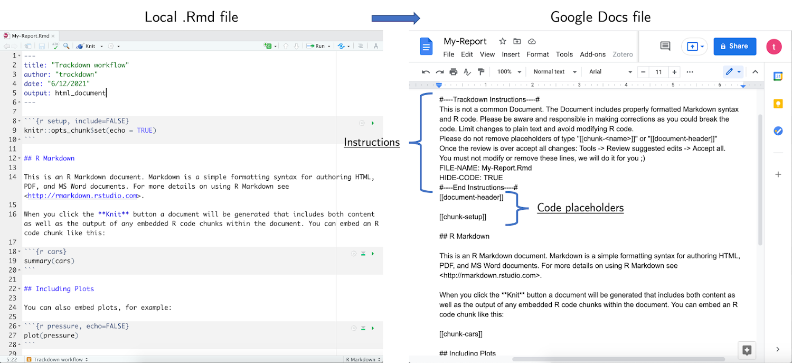
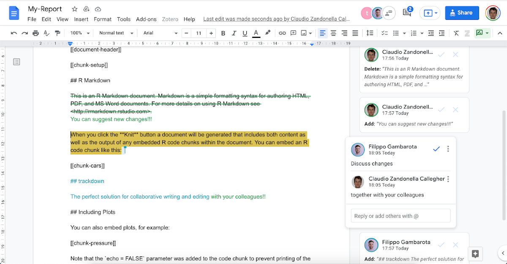

```{r, include = FALSE}
knitr::opts_chunk$set(
  collapse = TRUE,
  echo = TRUE,
  eval = FALSE,
  comment = "#>"
)
```

## The Workflow Idea {#wf-idea}

During the collaborative  writing of an `.Rmd` (or `.Rnw`) document, it is important to employ different workflows for computer code and narrative text:

- **Code** - Collaborative code writing is done most efficiently by following a traditional **Git**-based workflow using an online repository (e.g., GitHub or GitLab).
- **Narrative Text** - Collaborative writing of the narrative text is done most efficiently using **Google Docs** which provides a familiar and simple online interface that allows multiple users to simultaneously write/edit the same document.

Thus, the workflow’s main idea is simple: Upload the `.Rmd` (or `.Rnw`) document to Google Drive to collaboratively write/edit the narrative text in Google Docs; download the document locally to continue working on the code while harnessing the power of Git for version control and collaboration. This iterative process of uploading to and downloading from Google Drive continues until the desired results are obtained. The workflow can be summarized as:

> Collaborative **code** writing using **Git** & collaborative writing of **narrative text** using **Google Docs** 

{ width=100% }

`trackdown` offers different functions to manage this workflow:

- `upload_file()` uploads a file for the first time to Google Drive.
- `update_file()` updates the content of an existing file in Google Drive with the contents of a local file.
- `download_file()` downloads the edited version of a file from Google Drive and updates the local version. 
- `render_file()` downloads a file from Google Drive and renders it locally.

For a general overview of the package, see the `trackdown-package` help page or  `vignette("trackdown-features")` for a detailed description of function arguments and features and `vignette("trackdown-tech-notes")` for technical details. 

## Workflow Example {#wf-example}

Here a hypothetical workflow using `trackdown` is described as an example. The actual workflow is flexible and depends on the specific needs and circumstances of a given user and project.

Suppose you want to collaborate with your colleagues on the writing of an R Markdown document, e.g., to prepare a submission to a scientific journal. If you are the most experienced among your colleagues in the usage of R and programming in general, you should take responsibility for managing and organizing the workflow. 

#### Upload File {#ex-upload}

You create the initial document, for example `My-Report.Rmd`, and upload the file to Google Drive using the function `upload_file()`:

```{r, echo = TRUE, eval = FALSE}
trackdown::upload_file(file = "Path-to-file/My-Report.Rmd", hide_code = TRUE)
```

By executing this command, the `My-Report.Rmd` file is uploaded from your local computer to your Google Drive. By default, the file is uploaded to Google Drive using the same name as the local file (without extension) and saved in a folder named `trackdown/`. 

Note that `trackdown` adds some simple instructions and reminders on top of the document and, by specifying the argument `hide_code = TRUE` (default is `FALSE`), the header code (YAML) and code chunks are removed from the document displaying instead placeholders of type "[[document-header]]" and "[[chunk-\<name\>]]" (See Figure below). This allows collaborators to focus on the narrative text. 

{ width=100% }

#### Collaborate

After uploading your document to Google Drive, you can now share a link to the document with your colleagues and invite them to collaborate on the writing of the narrative text.

Google Docs offers a familiar, intuitive, and free web-based interface that allows multiple users to simultaneously write/edit the same document (See Figure below). In Google Docs it is possible to :

- track changes (incl. accepting/rejecting suggestions)
- add comments to suggest and discuss changes
- check spelling and grammar errors (potentially integrating third-party services like Grammarly)

<center>
{ width=100% }
</center>

Moreover, Google Docs allows anyone to contribute to the writing/editing of the document. No programming experience is required, users can just focus on writing/editing the narrative text. Remember that working on the parts of the document including code should be avoided.

Note that not all collaborators have to have a Google account (although this is recommended to utilize all Google Docs features). Only the person who manages the `trackdown` workflow needs to have a Google account to upload files to Google Drive. Other collaborators can be invited to contribute to the document using a shared link (See [Instructions](https://support.google.com/drive/answer/2494822?co=GENIE.Platform%3DDesktop&hl=en&oco=0)).

#### Download File {#ex-download}

At some point, you will want to add some code to the document to include figures, tables, or analysis results. This should not be done in Google Docs, instead, you should first download the document.

Before downloading the document from Google Drive, however, it is important that you accept (or reject) all changes made by your collaborators to the document in Google Docs. An easy way to accept all changes at once is the menu command “*Tools* > *Review suggested edits* > *Accept all*”. Now the edited version of the document can be downloaded from Google Drive using the function `download_file()`:

```{r, echo = TRUE, eval = FALSE}
trackdown::download_file(file = "Path-to-file/My-Report.Rmd")
```

Note that downloading the file from Google Drive will overwrite the local file.  

#### Update File {#ex-update}

Once you added the required code chunks, further editing of the narrative text may be necessary. In this case, you first update the file in Google Drive with your local version of the document using the function `update_file()`:

```{r, echo = TRUE, eval = FALSE}
trackdown::update_file(file = "Path-to-file/My-Report.Rmd", hide_code = TRUE)
```

By executing this command, the document in Google Drive is updated with your latest local changes. Now you and your colleagues can continue collaborating on the writing of the document. This iterative process of updating the file in Google Drive and downloading it locally continues until the desired results are obtained. Note that updating the file in Google Drive will overwrite its current content losing any tracked changes.

#### Render File {#ex-render}

Once the document is finished and all changes have been accepted, you can download the document and automatically compile the document to obtain the rendered output using the function `render_file()`:

```{r, echo = TRUE, eval = FALSE}
trackdown::render_file(file = "Path-to-file/My-Report.Rmd")
```

This function is simply a wrapper around `download_file()` that will additionally call `rmarkdown::render()` once the document has been downloaded.

#### A Quick Check {#ex-check}

Taking advantage of the "*Undo*" option available in Google Docs, it is possible to download the current document version at any time during the workflow without the need to accept all suggested edits permanently. You can:

1. Use the menu option “*Tools* > *Review suggested edits* > *Accept all*” to momentarily accept all changes.
2. Download (and render) the current version of the document using `download_file()` (or `render_file()`) function.
3. In Google Drive, press "*Undo*" to restore the document to its previous state (i.e., before accepting all changes).

This way, it is possible to check the current document and compile it locally at any time, without the need to accept all suggested edits permanently. Note, however, that it is not possible to update the document in Google Drive with local changes. This would overwrite the current content losing tracked changes.  

## Collaboration: Narrative Text vs Code {#collab}

As stated above, during the collaborative writing/editing of an `.Rmd` (or `.Rnw`) document, it is important to employ different workflows for computer code and narrative text. Collaborative code writing should be based on version control systems like Git, whereas collaborative writing of the narrative text can be done more efficiently in Google Docs. Let's further discuss these two aspects:

- **Code** - Collaborative code writing is done most efficiently using version control systems like **Git**. Ideally, collaborators working on the code are experienced enough to organize the project in an online repository (e.g., GitHub or GitLab) and manage the workflow using Git. Writing or editing actual code in Google Docs, although possible, is strongly discouraged as it is not possible to run the code to check if it is correct. Thus, it is very easy to introduce errors that would break the code. It is highly recommended to write code in an appropriate IDE (e.g., RStudio).

- **Narrative Text** - To facilitate the collaborative writing of the narrative text, `trackdown` moves the whole process to **Google Docs**. However, collaborators should be aware that when the document is downloaded from Google Drive it is still considered as an `.Rmd` (or `.Rnw`) file. Thus, any formatting (e.g., bold, italic, titles, font size, etc.) done in Google Docs will be lost. To effectively format text, one has to use proper Markdown (or LaTeX) syntax. Collaborators with no experience in these markup languages could find this too demanding. In this case, they might prefer to modify the text using the common formatting options and leave it to their more experienced collaborators to *translate* the text formatting into the appropriate Markdown (or LaTeX) syntax.

Overall, the workflow proposed by `trackdown` for collaborative writing of an R Markdown (or Sweave) document is an iterative process where the document is uploaded/updated to Google Drive for collaborative writing/editing of the narrative text in Google Docs and downloaded locally for collaborative code writing using Git. 

Note that the main limitation of this workflow is that it is not possible to simultaneously collaborate on the narrative text and the code included in the document. In this case, changes would be made on two different copies of the document---changes of the narrative text would be saved in the Google Drive copy of the document, whereas changes of the code would be saved in the local copy of the document. These two document versions can not be automatically merged by `trackdown` but only overwritten, thus losing one of the two versions. However,  structuring the workflow into sequential steps will guarantee a smooth experience.

An alternative solution to this problem is to keep the inclusion of R code in the R Markdown file to a minimum. By separating out all code used to, e.g., conduct statistical analyses, generate figures or tables, etc., in separate files and only calling the R objects generated by this code in the R Markdown file, writing code and narrative text can proceed simultaneously and without interfering with each other.
